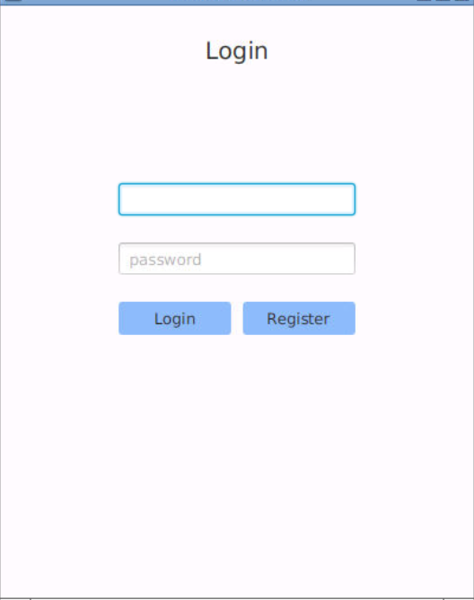
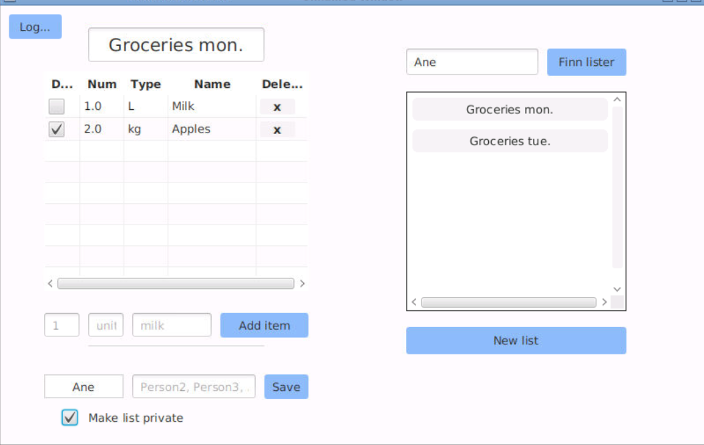

# Shoppinglist

## Om appen
Applikasjonen skal være en applikasjon for å skrive og redigerere handlelister. 
Med unik brukerprofil vil man ha muligheten til å dele handlelistene sine med andre.
Man har også muligheten til å ta del i andres, dersom disse er satt til å være offentlige.

Prosjektet er konfigurert som et multi-modul-prosjekt med Maven.
Prosjektet er her delt i modulene:
- core -  innheolder applikasjonens domene- og persistenslag
- fxui - inneholder brukergrensesnittet 
- restapi - inneholder filer for kobling mellom server og klient 
- restapiserver - inneholder serveren

Mer informasjon om hvert lag ligger i egne README-filer inne i mappene

I denne mappen ligger også en egen fil for brukerhistorier, for videre forklaring av applikasjonens ønskede virkemåte. 

### Konfigurering med Maven og kjøring av prosjektet
Prosjektet er konfigurert med Maven, og kan kjøres på følgende måte:
1. *mvn clean install*  – kjøres i rotmappen shoppinglist 
2. *mvn exec:java -f restapiserver* – starter serveren. Kjøres i egen terminal i mappen shoppinglist
3. *mvn javafx:run -f fxui* – åpner applikasjonen.
4. *mvn test* - kan kjøres for å teste applikasjonen

### Verktøy for testing av kodekvalitet 
* Spotbugs: analyse av programmerings- og logikkfeil i koden 
* Checkstyle: sjekker for uregelmessigheter i koden som tekstelement
* Jacoco: gir informasjon om kodens testdekningsgrad 

## Arkitekturdiagram

## Appliksjonens brukergrensesnitt 

## Brukerhistorier

Som bruker ønsker jeg å kunne lagre lister for meg selv og andre brukere. Jeg ønsker å ha oversikt over hvilke lister jeg er en del av. Jeg ønsker også å kunne legge til og fjerne andre brukere fra listen min når som helst.

Som bruker ønsker jeg en applikasjon der jeg registrere meg og ha egne handlelister lagret.

Som bruker ønsker jeg å kunne redigere innholdet i lister ved supplering, avhuking og sletting av elementer. 

Som bruker ønsker jeg å kunne endre på elementer uten å slette den først.

