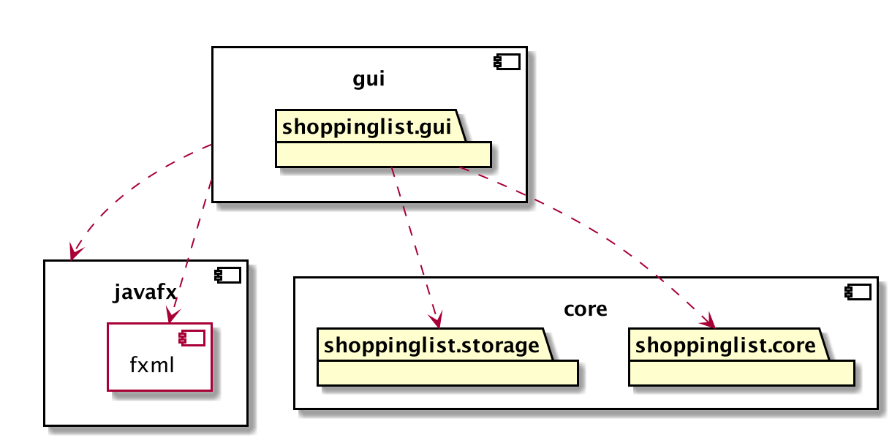
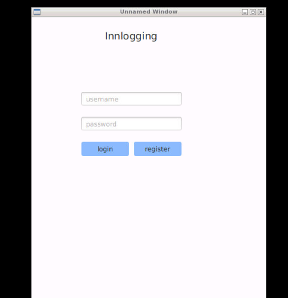
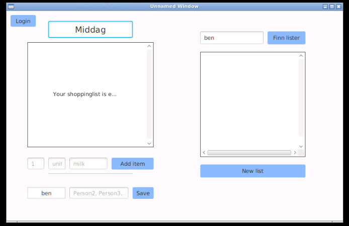

# Shoppinglist

## Om appen
Applikasjonen skal være en applikasjon for å dele handlelister.
Flere brukere vil ha tilgang til samme handleliste, og her kunne legge til og sjekke av elemeneter.
Brukere vil kunne ha tilgang til flere handlelister, og hver handleliste vil kunne deles av flere brukere. 

Prosjektet er konfigurert som et multi-modul-prosjekt
Prosjektet er her delt i et core-lag og et fxui-lag, der applikasjonens domene- og persistenslag ligger i core, og brukergrensesnittet ligger i fxui. 

### Konfigurering med Maven
Prosjektet er konfigurert med Maven, og kan gjøres med mvn javafx:run og testes med mvn test

## Arkitekturdiagram

## Brukerhistorier

Som bruker ønsker jeg å kunne lagre lister for meg selv og andre brukere. Jeg ønsker å ha oversikt over hvilke lister jeg er en del av. 

Som bruker ønsker jeg en applikasjon der jeg registrere meg og ha egne handlelister lagret.

Som bruker ønsker jeg å kunne redigere innholdet i lister ved supplering, avhuking og sletting av elementer. 

Som bruker ønsker jeg å kunne endre på elementer uten å slette den først.

 
 

