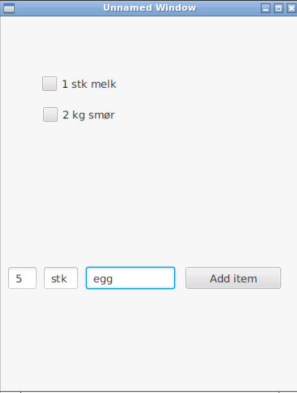

# ShoppingList

## Om appen
Applikasjonen skal være en applikasjon for å dele handlelister.
Flere brukere vil ha tilgang til samme handleliste, og her kunne legge til og sjekke av elemeneter.
Brukere vil kunne ha tilgang til flere handlelister, og hver handleliste vil kunne deles av flere brukere. 

## Organisering av koden
Prosjektet er organisert i:
**shoppinglist/src/shoppinglist** for javakoden
**shoppinglist/test** for tester 

### Domenelaget
Inneholder klasser for logikken i applikasjonen.
Shoppinglist.java og shoppingelement.java holder styr på hendholdsvis de ulike handlelistene og de ulike elementene i handlelistene.
Person.java holder logikk for brukerene av applikasjonen, slik at flere brukere skal kunne ha tilgang til samme handleliste, samt at en bruker kan ha tilgang til flere handlelister.
MeasurementType.java har logikk for måleenheter brukt i shoppingelementene. 
Ligger i [shoppinglist.core](https://gitlab.stud.idi.ntnu.no/it1901/groups-2020/gr2049/gr2049/-/tree/master/shoppinglist%2Fsrc%2Fshoppinglist%2Fcore)

### Brukergrensesnittlaget
Brukergrensesnittet er laget med JavaFX og FXML. Filene App.fxml, App.java og AppController.java danner brukergrensesnittet av handlelisten.
Her vises handlelistelementene, samt knapper for å legge til og fjerne elementer. I brukergrensesnittet vil det også være felt og knapper for innhenting av tidligere lagrede handlelister.
Ligger i [shoppinglist.gui](https://gitlab.stud.idi.ntnu.no/it1901/groups-2020/gr2049/gr2049/-/tree/master/shoppinglist%2Fsrc%2Fshoppinglist%2Fgui)

### Persistenslaget 
Persistenslaget inneholder logikk for lagring av handlelistene. Per nå lagres og hentes handlelistene som tekstfiler.
Ligger i [shoppinglist.storage](https://gitlab.stud.idi.ntnu.no/it1901/groups-2020/gr2049/gr2049/-/tree/master/shoppinglist%2Fsrc%2Fshoppinglist%2Fstorage)

### Bygging med maven 
Prosjektet er konfiguerert med maven, og kan kjøres ved javafx:run og testes med mvn test

## Brukerhistorie
Vi ønsker at en bruker skal kunne åpne en eksisterende handleliste, enten en den selv har laget tidligere, eller en del har fått tildelt av en annen bruker.
Deretter vil brukeren kunne se alle tidligere elementer, samt kunne legge til nye, fjerne og sjekke av elementer. 

