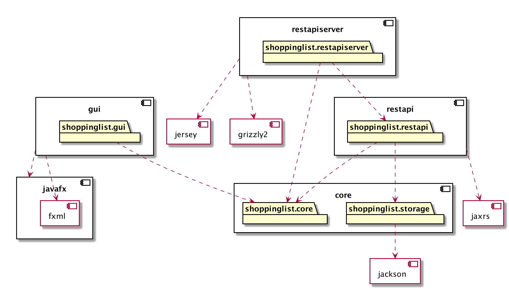

# Shoppinglist

## Om appen
Applikasjonen skal være en applikasjon for å skrive og redigerere handlelister. 
Med unik brukerprofil vil man ha muligheten til å dele handlelistene sine med andre.
Man har også muligheten til å ta del i andres, dersom disse er satt til å være offentlige.

Prosjektet er konfigurert som et multi-modul-prosjekt med Maven.
Prosjektet er her delt i modulene:
- core -  innheolder applikasjonens domene- og persistenslag 
- fxui - inneholder brukergrensesnittet 
- restapi - inneholder 
- restapiserver - inneholder

### Konfigurering med Maven
Prosjektet er konfigurert med Maven, og kan gjøres med mvn javafx:run og testes med mvn test
### Starting av server
For at serverlogikken skal virke må serveres startes med kommandoen ***

## Arkitekturdiagram

## Brukerhistorier

Som bruker ønsker jeg å kunne lagre lister for meg selv og andre brukere. Jeg ønsker å ha oversikt over hvilke lister jeg er en del av. Jeg ønsker også å kunne legge til og fjerne andre brukere fra listen min når som helst.

Som bruker ønsker jeg en applikasjon der jeg registrere meg og ha egne handlelister lagret.

Som bruker ønsker jeg å kunne redigere innholdet i lister ved supplering, avhuking og sletting av elementer. 

Som bruker ønsker jeg å kunne endre på elementer uten å slette den først.

 
 

