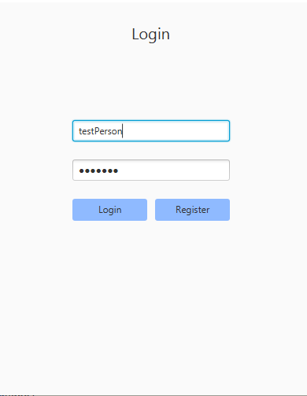

# Shoppinglist

## Om appen
Applikasjonen skal være en applikasjon for å skrive og redigerere handlelister. 
Med unik brukerprofil vil man ha muligheten til å dele handlelistene sine med andre.
Man har også muligheten til å ta del i andres, dersom disse er satt til å være offentlige.

Prosjektet er konfigurert som et multi-modul-prosjekt med Maven.
Prosjektet er her delt i modulene:
- core -  innheolder applikasjonens domene- og persistenslag
- fxui - inneholder brukergrensesnittet 
- restapi - inneholder filer for kobling mellom server og klient 
- restapiserver - inneholder serveren

Mer informasjon om hvert lag ligger i egne README-filer inne i mappene

I denne mappen ligger også en egen fil for brukerhistorier, for videre forklaring av applikasjonens ønskede virkemåte. 

### Konfigurering med Maven og kjøring av prosjektet
Prosjektet er konfigurert med Maven, og kan kjøres på følgende måte:
1. *mvn clean install*  – kjøres i rotmappen shoppinglist 
2. *mvn exec:java -f restapiserver* – starter serveren. Kjøres i egen terminal i mappen shoppinglist
3. *mvn javafx:run -f fxui* – åpner applikasjonen.
4. *mvn test* - kan kjøres for å teste applikasjonen

### Verktøy for testing av kodekvalitet 
* Spotbugs: analyse av programmerings- og logikkfeil i koden 
* Checkstyle: sjekker for uregelmessigheter i koden som tekstelement
* Jacoco: gir informasjon om kodens testdekningsgrad 

## Brukerhistorier
Brukerhistorier for applikasjonen ligger i [Brukerhistorier.md](https://gitlab.stud.idi.ntnu.no/it1901/groups-2020/gr2049/gr2049/-/blob/master/shoppinglist/Brukerhistorier.md)

## Arkitekturdiagram

## Utforske funksjonalitet
For å få innsikt i appens funksjonalitet har vi gjort det mulig å logge inn på brukeren "Sensor" med passordet "Passord". 
Etter at man har logget inn med riktig brukernavn og passord kan man prøve å lage både privat og offentlig liste (satt som standard). 
For å ta del i andres offentlige  lister er brukeren "MariasMat" opprettet.
Videre kan man søke opp "MariasMat" i søkefeltet og lagre seg selv i hennes offentlige liste "Taco-fredag".

## Appliksjonens brukergrensesnitt 

