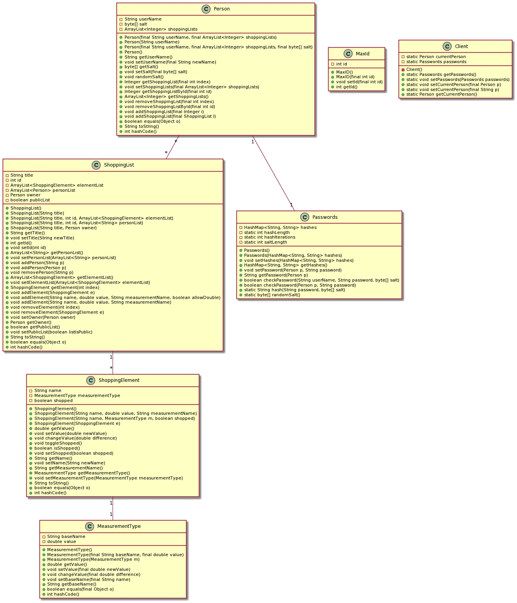

# Core module
- **Client** - abstraksjon for bruker
- **MaxId** - Angir maxId for en handleliste.
- **MeasurmentType** - Angir enheten til et shopping-element
- **ShoppingElement** - Angir et spesefikt elemnt i listen
- **ShoppingList** - Angir en handleliste med tilhørende elementer

## Class diagram of the core module

